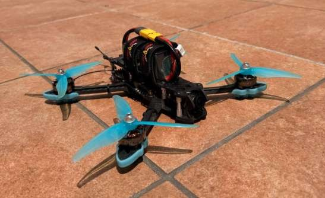

[README.md](https://github.com/user-attachments/files/30123044/README.md)
# Dron FPV 5" — Diseño, construcción y caracterización experimental

**Trabajo Fin de Grado · Ingeniería Electrónica Industrial y Automática · Universidad de Burgos (2026)**
Autor: Guzmán Ortega Domingo · Calificación: Sobresaliente

> **EN summary:** Design, build, tuning and experimental characterisation of a 5-inch FPV quadcopter based entirely on open-market hardware and free firmware (Betaflight + ExpressLRS). All eleven quantified requirements were met with margin: 545 g AUW, 10.6:1 thrust-to-weight, <10 ms stick-to-motor latency, <30 ms video latency, €485.55 total material cost. Includes a real-time object detection proof of concept (YOLOv8) running on the analogue FPV video feed.

---

## El proyecto en 30 segundos

Diseñar, montar, configurar y —sobre todo— **medir** un cuadricóptero FPV de 5 pulgadas para uso recreativo y carreras amateur. Nada de kit prefabricado: cada componente se seleccionó mediante un método deductivo **necesidad → opciones → comparativa → selección**, partiendo de once requisitos cuantificados definidos al inicio.

| Requisito | Objetivo | Resultado |
|---|---|---|
| Peso en vuelo (AUW) | ≤ 600 g | **545 g** |
| Relación empuje-peso | ≥ 8:1 | **10,6:1** |
| Latencia stick-to-motor | < 10 ms | **5–8 ms** |
| Latencia de vídeo | < 30 ms | **< 30 ms** |
| Coste de materiales | ≤ 700 € | **485,55 €** |

## Hardware principal

| Subsistema | Componente | Modelo |
|---|---|---|
| Estructura | Frame | iFlight Mark4 5" |
| Propulsión | Motores | EMAX ECO II 2306 1900 KV (×4) |
| Propulsión | Hélices | Gemfan Hurricane 51477 |
| Aviónica | Stack FC + ESC | SpeedyBee F405 V5 + BLS 55A |
| Radiocontrol | Receptor | RadioMaster RP4TD (ExpressLRS 2.4 GHz) |
| Radiocontrol | Emisora | RadioMaster Pocket (EdgeTX) |
| Vídeo | VTX | B-CUBE VTX800 (5.8 GHz analógico) |

Firmware: **Betaflight** (volcado CLI completo en [`config/`](config/)) y **ExpressLRS**.

## Resultados experimentales

Campaña de 7 vuelos clasificados en tres perfiles operacionales (hover, angular suave, agresivo), con amperímetro calibrado:

- **Autonomía:** 9,9 min (hover) · 8,6 min (angular suave) · 5,8–6,3 min (agresivo), al 80 % de profundidad de descarga
- **Térmica:** ESC entre 47–53 °C, muy por debajo del límite del subsistema de potencia
- **Enlace radio:** RSSI mínimo −75 dBm, Link Quality siempre > 93 %
- **Validación del power budget:** corriente media real en hover de 7,51 A frente a 7,0 A de la predicción teórica

Hallazgo curioso: el vuelo angular suave consume solo ~15 % más que el hover (2,22 vs 1,94 Wh/min). El vuelo recreativo moderado sale casi al precio del estacionario.

## Cosas que salieron mal (y qué aprendí)

Porque un proyecto real sin incidencias no existe:

- **Receptor HappyModel EP2 V1.0 imposible de configurar.** Tras un diagnóstico sistemático (dominio regulatorio, modo WiFi, EdgeTX, hipótesis de bootloader forzado, terminal serie) y consultar a la comunidad ExpressLRS, se sustituyó por un RadioMaster RP4TD. Lección: las cadenas de configuración ELRS tienen más eslabones de los que parece, y saber diagnosticar vale tanto como saber montar.
- **Antena Lollipop 3 (SMA) incompatible con el VTX (MMCX).** Lección reproducible: verificar la compatibilidad *mecánica* de los conectores antes de comprar, no solo la eléctrica.
- **Disco duro muerto a dos semanas de la entrega.** Lección: el backup sistemático no es opcional. Ahora es disciplina.

## Extra: visión por computador sobre el feed FPV

Prueba de concepto de detección de objetos en tiempo real con **YOLOv8** sobre la cadena de vídeo analógica del dron, demostrando la viabilidad técnica de la detección sobre señal analógica capturada. Código en [`vision/`](vision/). Línea de continuación: integración a bordo con computador embarcado (Jetson / Raspberry Pi con NPU).

## Contenido del repositorio

- [`docs/`](docs/) — Memoria completa del TFG (230 págs., PDF)
- [`config/`](config/) — Volcado CLI de Betaflight y configuración ExpressLRS
- [`vision/`](vision/) — Prueba de concepto YOLOv8
- [`img/`](img/) — Fotos del montaje y vuelos

## Contacto

Si trabajas en electrónica, sistemas embebidos o software y algo de esto te encaja: [LinkedIn](https://www.linkedin.com/in/TU-URL-AQUI/)

*Publicado bajo licencia abierta para facilitar la continuación del proyecto a futuros estudiantes.*
